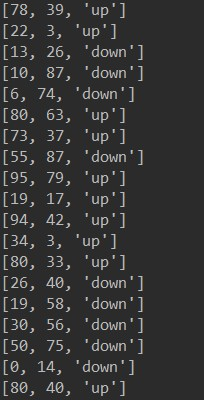
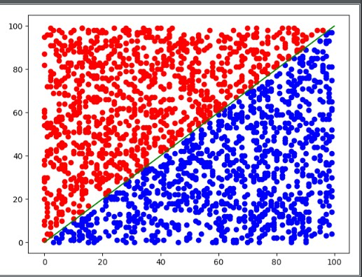

# Algorithm_K_Neighbor
This project is the implementation of the K nearest neighbor algorithm
* data was created like this

* 'up' means the data on the top of the function y=x
* 'down' means the data on the bottom of the function y=x

